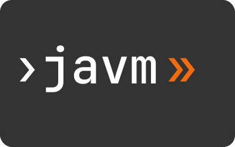

<p align="center">

</p>

[](https://github.com/felipebz/javm/actions)
[](https://sonarqube.felipebz.com/dashboard?id=javm)

**javm** is a fast, cross‑platform Java version manager (fork of [jabba](https://github.com/shyiko/jabba)) focused on a frictionless install 
and switch workflow for JDKs on Linux, macOS and Windows.

## Features

- Install & switch between multiple JDK distributions (Zulu, OpenJDK, GraalVM, Temurin, etc.) using semver ranges
- Per‑project JDK via `.javmrc` (checked into VCS)
- Remote discovery (DiscoAPI integration) + custom URLs
- Supports semantic version ranges (`1.8.x`, `~17.0.2`, `>=21 <22`)
- Clean removal (`uninstall`, `deactivate`) without touching system JDK
- Static Go binary: fast cold start and no additional dependency


## Installation

You can install `javm` using the provided install scripts. They automatically detect your platform and architecture, and support different release channels:

- `latest`: install from the latest GitHub Release (default)
- `nightly`: install the most recent development build
- Specific version: e.g. `v0.1.0`

### 🪟 Windows

By default, installs the latest release to `%LOCALAPPDATA%\Programs\javm`.

To install the latest release:

```powershell
irm https://github.com/felipebz/javm/raw/main/install.ps1 | iex
```

To install a specific version or channel:

```powershell
iex "& { $(irm https://github.com/felipebz/javm/raw/main/install.ps1) } nightly"
iex "& { $(irm https://github.com/felipebz/javm/raw/main/install.ps1) } v0.1.0"
```

## Shell Setup

To enable javm in your shell, you need to evaluate the output of `javm init <shell>`.

### Bash

Add this to your `~/.bashrc` or ~/.zshrc:

```bash
eval "$(javm init bash)"
```

### Zsh

Add this to your `~/.zshrc`:

```zsh
eval "$(javm init zsh)"
```

### Fish

Add this to your `~/.config/fish/config.fish`:

```fish
javm init fish | source
```

### PowerShell

Add this to your profile file:

```powershell
iex "$(javm init pwsh)" 
```

> [!TIP]
> To check the path to your PowerShell profile file, run:
> ```powershell
> echo $PROFILE
> ```

## Post Setup

After editing your profile or config, restart your shell or reload your profile to apply the changes.

## Usage

### Listing / Searching

```sh
javm ls-remote                      # list all available JDKs
javm ls-remote zulu@~1.8.60         # narrow by distribution & semver range
javm ls-remote "*@>=1.6.45 <1.9" --latest=minor  # show only latest minors
```

### Installing

```sh
javm install zulu@1.8               # Zulu OpenJDK 8 (latest matching)
javm install zulu@~1.8.144          # same as zulu@>=1.8.144 <1.9.0
javm install temurin@17             # Temurin 17 LTS
javm install graalvm@21             # GraalVM
javm install openjdk@21             # Upstream OpenJDK
javm install 1.8.0-custom=https://example.com/dist.tar.gz
```

### Using / Switching

```sh
javm ls                              # list installed
javm use zulu@1.8
javm use temurin@17
javm deactivate                      # restore previous JAVA_HOME / PATH
```

### Per‑Project Version (`.javmrc`)

Create a `.javmrc` in your project root:

```yaml
jdk: 17
```

or just:

```yaml
17
```

Then:

```sh
javm use   # picks version from .javmrc
```

### Aliases

```sh
javm alias default 17       # sets default JDK for new shells
javm alias list
```

### Linking Existing System JDK

```sh
javm link system@1.8.72 /Library/Java/JavaVirtualMachines/jdk1.8.0_72.jdk
```

### Uninstall

```sh
javm uninstall zulu@1.8
```


> `.javmrc` has to be a valid YAML file. JDK version can be specified as `jdk: 1.8` or simply as `1.8` 
(same as `~1.8`, `1.8.x` `">=1.8.0 <1.9.0"` (mind the quotes)).

For more information see `javm --help`.  

## Development

Prerequisite: Go **1.24.x**

```sh
git clone https://github.com/felipebz/javm
cd javm
go test ./...
go build -o javm .
./javm --help
```

## FAQ

**Q: Does it override my system Java?**\
No. `javm use` adjusts your shell `PATH` and `JAVA_HOME` *in that session*.

**Q: How do I revert to the system JDK?**\
Run `javm deactivate` or open a new shell (if no default alias points elsewhere).

**Q: Can I pin a project JDK?**\
Yes: `.javmrc` with `jdk: <range>` then `javm use` inside that directory.

**Q: Why not install “globally”?**\
Global changes (e.g. system alternatives, registry edits) vary by OS and often require sudo/admin; javm keeps things user‑scoped and portable.

## License

Apache-2.0. See [LICENSE](LICENSE).
