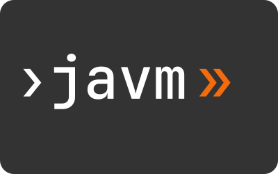

<p align="center">

</p>

<p align="center">
  <a href="https://github.com/felipebz/javm/releases"></a>
  <a href="LICENSE"></a>
  <a href="README.md"></a>
</p>

**javm** is a fast, cross‑platform Java version manager (fork of [jabba](https://github.com/shyiko/jabba)) focused on a frictionless install 
and switch workflow for JDKs on Linux, macOS and Windows.

<p align="center">
  
</p>

## Features

- Install & switch between multiple JDK distributions (Zulu, OpenJDK, GraalVM, Temurin, etc.) using semver ranges
- Per‑project JDK via `.java-version`
- Remote discovery through the Foojay DiscoAPI
- Supports semantic version ranges (`1.8.x`, `~17.0.2`, `>=21 <22`)
- Clean removal (`uninstall`, `deactivate`) without touching system JDK
- Static Go binary: fast cold start and no additional dependency

## Installation

You can install `javm` using the provided install scripts. They automatically detect your platform and architecture, and support different release channels:

- `latest`: install from the latest GitHub Release (default)
- `nightly`: install the most recent development build
- Specific version: e.g. `v0.1.0`

### Linux and macOS

By default, installs the latest release to `~/.javm`.

To install the latest release:

```bash
curl -fsSL https://javm.dev/install.sh | bash
```

To install a specific version or channel:

```bash
curl -fsSL https://javm.dev/install.sh | bash -s nightly
curl -fsSL https://javm.dev/install.sh | bash -s v0.1.0
```

### Windows

By default, installs the latest release to `%LOCALAPPDATA%\Programs\javm`.

To install the latest release:

```powershell
irm https://javm.dev/install.ps1 | iex
```

To install a specific version or channel:

```powershell
iex "& { $(irm https://javm.dev/install.ps1) } nightly"
iex "& { $(irm https://javm.dev/install.ps1) } v0.1.0"
```

## Shell Setup

To enable javm in your shell, initialize it with `javm init <shell>` as shown
for your shell below.

### Bash

Add this to your `~/.bashrc` or ~/.zshrc:

```bash
eval "$(javm init bash)"
```

### Zsh

Add this to your `~/.zshrc`:

```zsh
eval "$(javm init zsh)"
```

### Fish

Add this to your `~/.config/fish/config.fish`:

```fish
javm init fish | source
```

### PowerShell

Add this to your profile file:

```powershell
iex "$(javm init pwsh)" 
```

> [!TIP]
> To check the path to your PowerShell profile file, run:
> ```powershell
> echo $PROFILE
> ```

### Command Prompt (CMD)

Generate the CMD wrapper in a directory separate from `javm.exe`:

```batch
mkdir "%LOCALAPPDATA%\javm\cmd" 2>NUL
javm init cmd > "%LOCALAPPDATA%\javm\cmd\javm.cmd"
set "PATH=%LOCALAPPDATA%\javm\cmd;%PATH%"
```

Keep that wrapper directory before the directory containing `javm.exe` in your
user `PATH`, then open a new Command Prompt. CMD checks `.exe` before `.cmd`
inside the same directory, so placing both files together bypasses the wrapper
and prevents `use` and `deactivate` from changing the current session.

When invoking javm from another batch file, use `call javm ...` so control
returns to the calling script:

```batch
call javm use 21
call javm deactivate
```

### Nushell

Generate the script file using `javm init nu`:

```nushell
javm init nu | save -f ~/.local/share/javm/javm.nu
```

Add this to your `config.nu` (you can find it by running `$nu.config-path`):

```nushell
source ~/.local/share/javm/javm.nu
```

## Post Setup

After editing your profile or config, restart your shell or reload your profile to apply the changes.

## Usage

### Listing / Searching

```sh
javm ls-remote                      # list all available JDKs
javm ls-remote zulu@~1.8.60         # narrow by distribution & semver range
javm ls-remote "*@>=1.6.45 <1.9" --latest=minor  # show only latest minors
```

### Installing

```sh
javm install zulu@1.8               # Zulu OpenJDK 8 (latest matching)
javm install zulu@~1.8.144          # same as zulu@>=1.8.144 <1.9.0
javm install temurin@17             # Temurin 17 LTS
javm install graalvm@21             # GraalVM
javm install openjdk@21             # Upstream OpenJDK
```

To install a JDK in a new directory outside the managed `JAVM_HOME`, use
`--output`. The destination must not exist, and the resulting JDK is unmanaged
until it is linked explicitly:

```sh
javm install temurin@21 --output /opt/jdks/temurin-21
```

### Using / Switching

```sh
javm ls                              # list installed
javm ls --details                    # include vendor, architecture and path
javm use zulu@1.8
javm use temurin@17
javm deactivate                      # restore previous JAVA_HOME / PATH
```

### Per‑Project Version (`.java-version`)

Create a `.java-version` in your project root:

```
17
```

Then:

```sh
javm use   # picks version from .java-version
```

### Aliases

```sh
javm alias default 17       # sets default JDK for new shells
javm alias default          # shows the alias value
javm unalias default
```

### Inspecting and configuring

```sh
javm current                      # show the JDK selected in the current shell
javm which temurin@21             # show the selected JDK path
javm which --home temurin@21      # use the platform-specific JAVA_HOME path
javm config list                  # list effective configuration
javm config get java.default_distribution
javm config set java.default_distribution temurin
javm config unset java.default_distribution
javm discover refresh             # refresh the discovery cache
javm default temurin@21           # set the default for newly initialized shells
```

### Linking Existing System JDK

```sh
javm link system@1.8.72 /Library/Java/JavaVirtualMachines/jdk1.8.0_72.jdk
```

### Uninstall

```sh
javm uninstall zulu@1.8
```

### Exit codes

`javm` uses stable exit codes so scripts can distinguish common failure
classes:

| Code | Meaning |
| ---: | --- |
| 0 | Success, including `--help` |
| 1 | Unexpected or local operation failure |
| 2 | Invalid command usage or arguments |
| 3 | Requested JDK or other resource was not found |
| 4 | Remote service or download failure |
| 124 | Operation timed out |
| 130 | Interrupted with Ctrl+C |

## Development

Prerequisite: Go **1.26.x**

```sh
git clone https://github.com/felipebz/javm
cd javm
go test ./...
go build -o javm .
./javm --help
```

## FAQ

**Q: Does it override my system Java?**\
No. `javm use` adjusts your shell `PATH` and `JAVA_HOME` *in that session*.

**Q: How do I revert to the system JDK?**\
Run `javm deactivate` or open a new shell (if no default alias points elsewhere).

**Q: Can I pin a project JDK?**\
Yes: Create a `.java-version` with the JDK version then `javm use` inside that directory.

**Q: Why not install “globally”?**\
Global changes (e.g. system alternatives, registry edits) vary by OS and often require sudo/admin; javm keeps things user‑scoped and portable.

## License

Apache-2.0. See [LICENSE](LICENSE).
